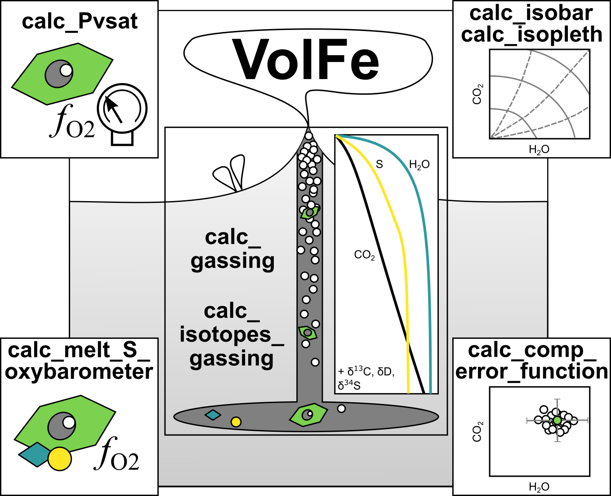

==============================
Introduction and citation
==============================

This is VolFe: an open-source Python package for calculating melt-vapor equilibra in the CHOS+ system, including concentration, speciation, and isotope ratios.

VolFe can be installed using pip from `PyPI <https://pypi.org/project/VolFe/>`_ or from `GitHub <https://github.com/eryhughes/VolFe>`_. Please install VolFe in its own environment because it will rewrite all your package versions.

VolFe is a work in progress. If you see any problems or have any feedback, super keen to hear it! Drop Ery an email at ery[dot]hughes[at]ucl[dot]ac[dot]uk.

If you want to know more about how VolFe works, check out the following articles (and please cite them if have used VolFe in your work!)

For chemistry (e.g., concentration and speciation):

Hughes EC, Liggins P, Wieser P, and Stolper EM (2025). VolFe: an open-source Python package for calculating melt-vapor equilibria including silicate melt, carbon, hydrogen, sulfur, and noble gases. Volcanica 8(2):457-481 https://doi.org/10.30909/vol/imvc1781

For isotope ratios (in the Supplementary Materials):

Saper LM, Bromiley G, Cao R, Brounce M, Hughes EC, and Woelki D (2025). The primary magmatic δ34S of the Troodos Ophiolite and evidence for early and late sulfide saturation. Lithos 518-519:108331 https://doi.org/10.1016/j.lithos.2025.108331

