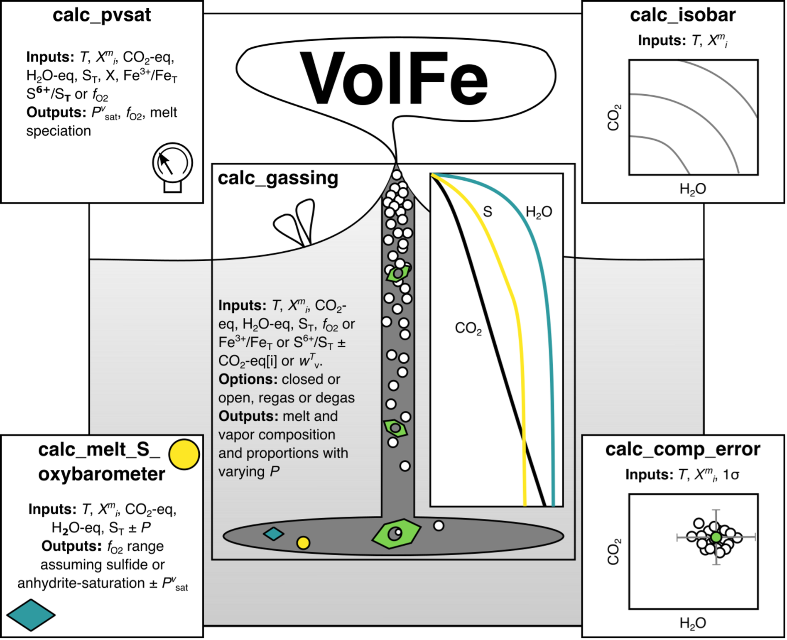

==============================
Introduction and citation
==============================

This is VolFe - an open-source python3 tool for calculating melt-vapor equilibra in the CHOS+ system.

This tool is a work in progress - if you see any problems or have any feedback, super keen to hear it! Drop Ery an email at e.hughes@gns.cri.nz.

If you have used VolFe in your work, please cite the pre-print available on EarthArXiv (and check back to see if it has been published!).

Hughes, E.C., Liggins, P., Wieser, P. and Stolper, E.M., 2024. VolFe: an open-source tool for calculating melt-vapor equilibria including silicate melt, carbon, hydrogen, sulfur, and noble gases. https://doi.org/10.31223/X52X3G

