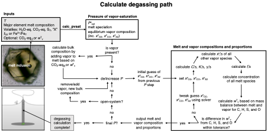

===================================================================================
Calculating degassing paths
===================================================================================

As magmas rise to the surface, volatiles dissolved in the melt exsolve into the vapor phase.

VolFe calculates the proportions of vapor and melt and their compositions and speciation during open- and closed-system, re- and degassing for various combinations of C, H, S, and noble gases as the volatile species.

This calculation is described in detail in Hughes et al. (in prep) (schematic in figure below, Hughes et al. in prep).

In this example we'll show you how to run this calculation for: 

- :doc:`Example 2a <Examples/2a. degas_closed_bulk>`: Closed-system CHOS degassing where the melt composition is the bulk composition of the system (with and without sulfur saturation). 

- :doc:`Example 2b <Examples/2b. degas_closed_gas>`: Closed-system CHOS degassing where there is melt and vapor at the start of degassing.

- :doc:`Example 2c <Examples/2c. degas_open>`: Open-system CHOS degassing.

- :doc:`Example 2d <Examples/2d. regas>`: Closed- and open-system CHOS regassing. [open-system part in progress]

- :doc:`Example 2e <Examples/2d. degas_notCHOS>`: Closed-system degassing for different volatile systems (including noble gases). [in progress]