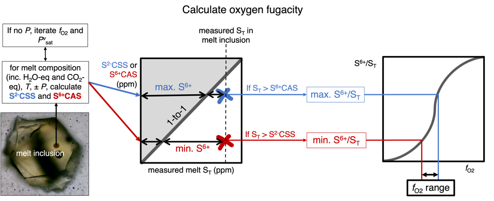

===============================================================
Oxygen fugacity from the melt sulfur content
===============================================================

Oxygen fugacity is a key thermodynamic parameter to estimate in magmatic systems because of its effects on the chemical and physical properties of the melt (REF). 
In certain circumstances, the sulfur content of the melt can be used to place bounds on the oxygen fugacity based on sulfide and anhydrite saturation (e.g., Beerman et al., 2011; Muth and Wallace, 2022; Hughes et al., 2023). 

This calculation was outlined in detail in Section “Using wmST as an oxybarometer” in Hughes et al. (2023) (schematic in figure below, Hughes et al. in prep).

In this example we'll show you how to run this calculation for: 

- :doc:`Example 3a <Examples/3a. SfO2 1MI_df>`: One analysis entered as a dataframe using default options. 

- :doc:`Example 3b <Examples/3b. SfO2 csv>`: Analyses in a csv file using default options. 

- :doc:`Example 3c <Examples/3c. SfO2 user_opt>`: Analyses in a csv file using user specified options. [in progress]