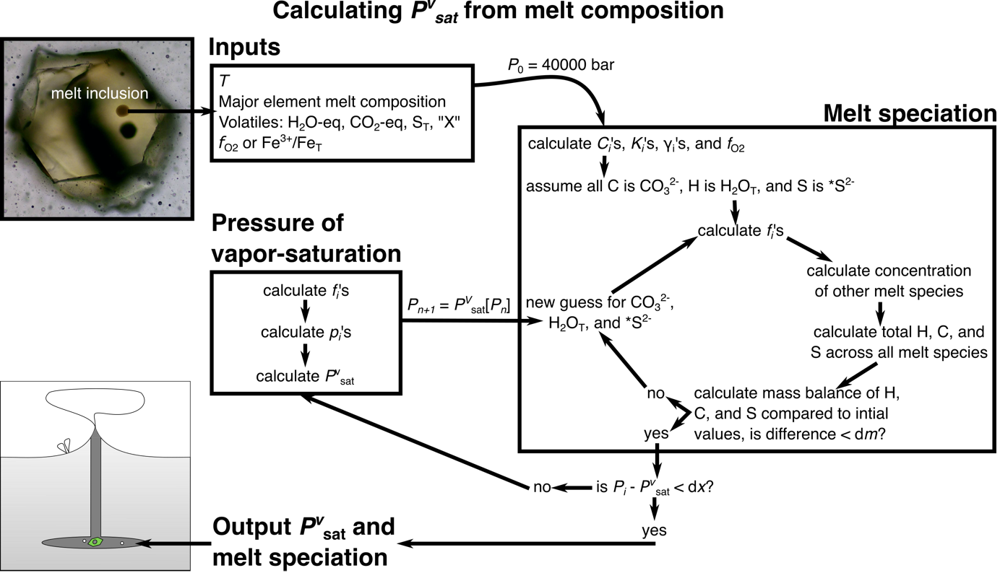

===================================================================================
Pressure of vapor-saturation
===================================================================================

The dissolved volatile content of a melt in equilibrium with a vapor can be used as a barometer because the sum of the partial pressures of all the vapor species must equal the total pressure (e.g., Anderson et al., 1989; Blundy & Cashman, 2009). 
This is the pressure of vapor saturation (Pvsat) barometer and is often applied to melt inclusions to calculate magma storage depths (e.g., Black and Andrews, 2020; Camejo-Harry et al., 2019, 2018; Colman et al., 2015; Wanless et al., 2015; Wieser et al., 2021) and sub-aqueous matrix glasses to calculate eruption depths (e.g., Belgrano et al., 2021; Coombs et al., 2006; Lund et al., 2018; Seaman et al., 2004). 

VolFe calculates Pvsat, the melt speciation, and the vapor composition for a melt of given temperature and melt composition (including volatiles and fO2). 

This calculation was outlined in detail `Hughes et al. (2024) <https://doi.org/10.2138/am-2022-8739>`_ (schematic in figure below, Hughes et al. in prep).

In this example we'll show you how to run this calculation for: 

- :doc:`Example 1a <Examples/1a. pvsat 1MI_df>`: One analysis entered as a dataframe using default options. 

- :doc:`Example 1b <Examples/1b. pvsat csv>`: Analyses in a csv file using default options. 

- :doc:`Example 1c <Examples/1c. pvsat user_opt>`: Analyses in a csv file using user specified options. [parts in progress]

- :doc:`Example 1d <Examples/1d. pvsat X>`: Changing the identity of "X".